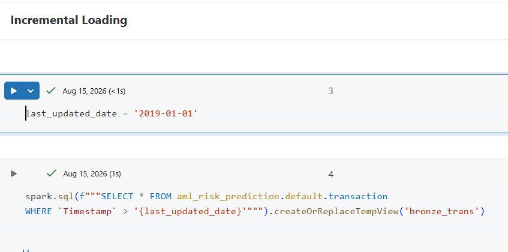
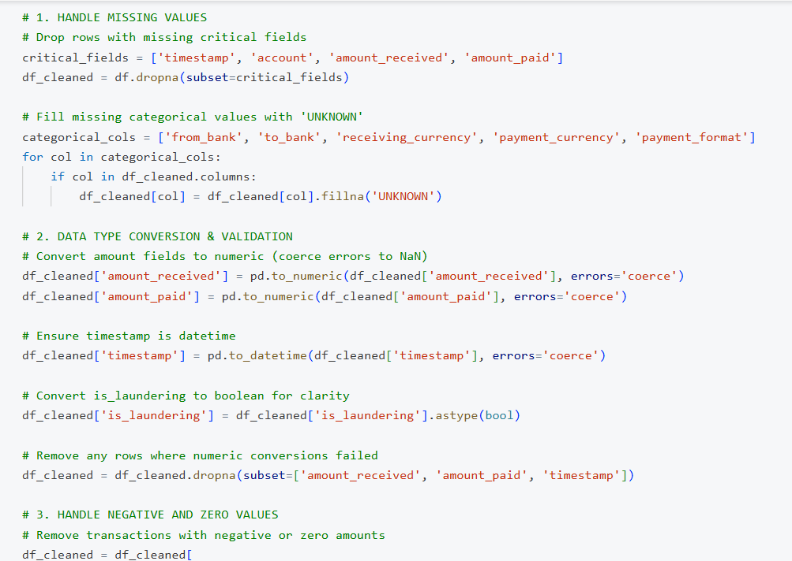
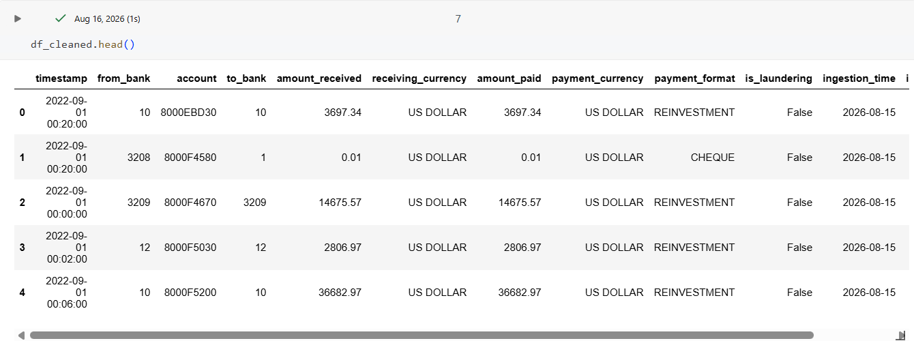
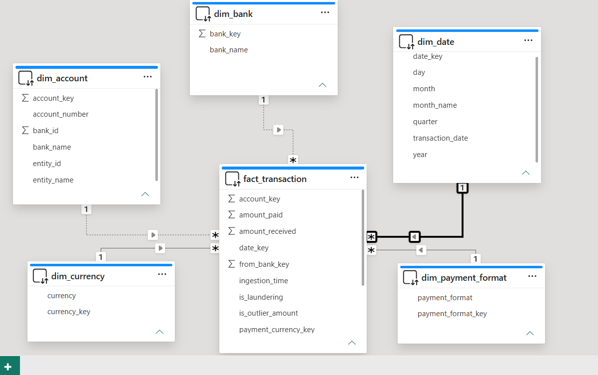
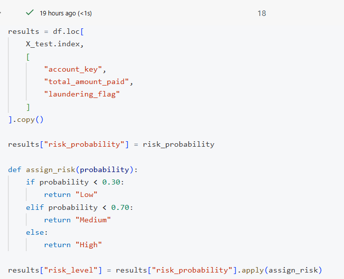
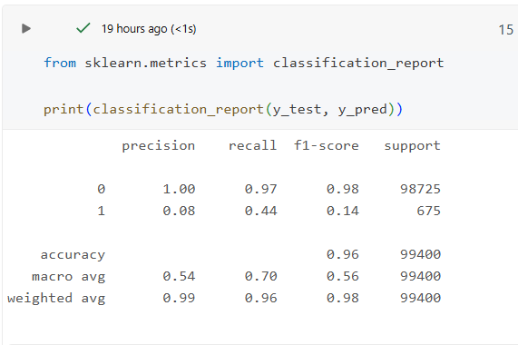
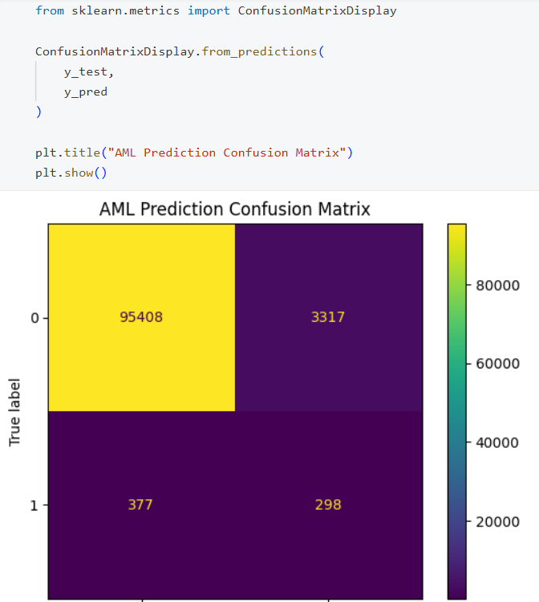

# AML Risk Prediction 

## 📌 Project Overview

An end-to-end **Anti-Money Laundering (AML) Risk Prediction** project designed to identify and classify potentially high-risk financial transactions.

The project combines **data engineering, dimensional data modeling, exploratory analysis, feature engineering, and machine learning** to transform raw transaction data into actionable AML risk categories.

The solution was developed using **Databricks, SQL, Python, Pandas, Delta Lake, and Logistic Regression**.

---

## 🎯 Business Problem

Financial institutions process millions of transactions every day, making it difficult to manually identify transactions that may require further investigation.

### Business Question

> **Can transaction and account-level behavioral patterns be used to predict and classify transactions into Low, Medium, and High AML risk categories?**

The goal is to create a scalable analytical pipeline that can help AML and financial-risk teams **prioritize potentially suspicious transactions for further investigation**.

---

## 🏗️ Data Architecture

The project follows the **Medallion Architecture** in Databricks:

```text
SOURCE DATA
     │
     ▼
┌─────────────┐
│   BRONZE    │
│ Raw Data    │
└─────────────┘
     │
     ▼
┌─────────────┐
│   SILVER    │
│ Cleaned &   │
│ Validated   │
│ Data        │
└─────────────┘
     │
     ▼
┌─────────────┐
│    GOLD     │
│ Dimensional │
│ Data Model  │
└─────────────┘
     │
     ▼
┌─────────────┐
│ ML FEATURES │
│ Feature     │
│ Engineering │
└─────────────┘
     │
     ▼
┌─────────────────────┐
│ LOGISTIC REGRESSION │
│ Risk Classification │
└─────────────────────┘
     │
     ▼
LOW │ MEDIUM │ HIGH
RISK│  RISK  │ RISK
```

---

## 📊 Dataset

The project uses the **IBM AML transaction dataset (HI-Small)** containing millions of synthetic financial transaction records.

Key information includes:

* Transaction information
* Account information
* Transaction amounts
* Payment formats
* Currencies
* Sender and receiver information
* Transaction timestamps
* AML-related indicators

---

## 🔄 Data Engineering

### Bronze Layer

The Bronze layer stores the raw source data with minimal transformation.

Key activities:

* Raw data ingestion
* Incremental loading
* Delta table creation
* Source data preservation



### Silver Layer

The Silver layer focuses on data cleaning and validation.

Key activities:

* Standardized transaction IDs
* Standardized account IDs
* Duplicate handling
* Missing-value checks
* Transaction amount validation
* Date/time standardization
* Currency standardization
* Transaction relationship validation
* Data-quality flags




### Gold Layer

The Gold layer prepares analytics-ready data using **dimensional modeling**.

The model follows a **star schema**:



## 🔎 Exploratory Data Analysis

EDA was performed to understand transaction behavior and identify patterns associated with AML risk.

Analysis included:

* Transaction amount distributions
* Transaction frequency
* Payment format patterns
* Currency behavior
* Account activity
* Sender/receiver relationships
* AML indicator patterns
* High-, medium-, and low-risk transaction distributions

---

## ⚙️ Feature Engineering

The ML feature layer transforms cleaned transaction data into model-ready variables.

Features include transaction and behavioral characteristics such as:

* Transaction amount
* Transaction frequency
* Account activity
* Payment format
* Currency information
* Sender/receiver behavior
* Transaction patterns
* AML-related indicators

Categorical variables were transformed into numerical representations suitable for machine learning.

---

## 🤖 Machine Learning Model

### Logistic Regression

A **Logistic Regression** model was selected as the initial classification model because it is:

* Easy to interpret
* Computationally efficient
* Suitable for classification
* Useful for understanding feature relationships
* Appropriate as a strong baseline model

The model predicts transaction risk categories:

```text
LOW RISK
MEDIUM RISK
HIGH RISK
```


---

## 📈 Model Evaluation

Model performance is evaluated using classification metrics such as:

* Accuracy
* Precision
* Recall
* F1-Score
* Confusion Matrix

For AML use cases, **recall and precision are particularly important**, since missing potentially risky transactions can be costly while excessive false positives can increase investigation workload.




---

## 💼 Business Impact

This project demonstrates how financial institutions can move from:

**Raw Transaction Data → Clean Data → Analytics Model → ML Features → Risk Classification**

Potential business applications include:

* Prioritizing transactions for AML investigation
* Identifying unusual transaction patterns
* Supporting risk-based monitoring
* Reducing manual transaction screening
* Improving analytical visibility into transaction behavior

> **Important:** This project is intended for educational and portfolio purposes and does not represent a production AML compliance system.

---

## 🛠️ Technology Stack

| Category          | Technologies                       |
| ----------------- | ---------------------------------- |
| Data Engineering  | Databricks, Delta Lake             |
| Data Processing   | Python, Pandas                     |
| Querying          | SQL                                |
| Data Architecture | Medallion Architecture             |
| Data Modeling     | Star Schema / Dimensional Modeling |
| Machine Learning  | Logistic Regression                |
| Analytics         | Exploratory Data Analysis          |
| Version Control   | Git / GitHub                       |

---


## 🔮 Future Improvements

Potential next steps include:

* Compare Logistic Regression with Random Forest or Gradient Boosting
* Address class imbalance using appropriate sampling techniques
* Add anomaly detection using unsupervised learning
* Implement model monitoring
* Add ML experiment tracking
* Deploy the model through a production-style Databricks workflow
* Build a Power BI risk monitoring dashboard

---

